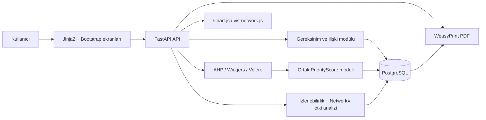

# Sistem mimarisi

REQS, Jinja2/Bootstrap arayüzü ile FastAPI REST katmanını aynı Python uygulamasında birleştirir. PostgreSQL kalıcı veri kaynağıdır; SQLAlchemy erişimi, Alembic şema sürümünü yönetir. NumPy AHP'yi, NetworkX ilişki/etki grafiğini, WeasyPrint PDF üretimini sağlar.

| Katman | Sorumluluk |
| --- | --- |
| Sunum | Formlar, sonuç tablosu, grafik ve ağ görünümü |
| API | Doğrulama, CRUD, puanlama, raporlama uçları |
| Alan | SQLAlchemy modelleri, NumPy/NetworkX hesapları |
| Veri | PostgreSQL tabloları ve Alembic migration'ları |

Veri, ekrandaki formdan Pydantic şemasına, oradan API/servis katmanına ve PostgreSQL'e akar. Sonuç ekranı `PriorityScore` kayıtlarını, matris/ağ ise aynı `RequirementRelation` kayıtlarını okur; böylece iki görünümde ayrı ilişki kaynağı oluşmaz.
