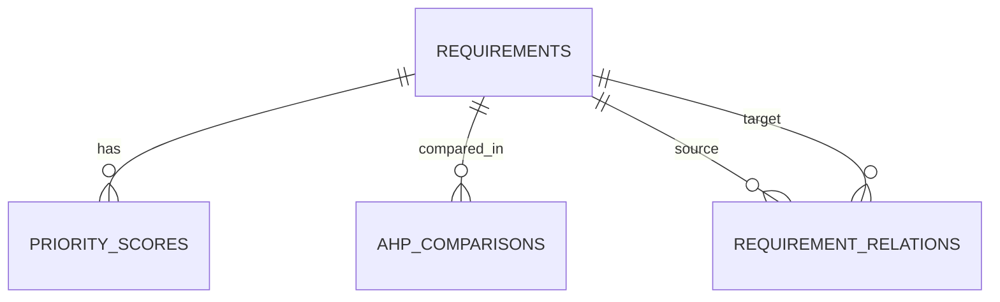

# Veritabanı tasarımı

## Tablolar

| Tablo | Amaç | Temel alanlar |
| --- | --- | --- |
| `requirements` | Gereksinim backlog'u | `id`, `key`, `title`, `description`, `requirement_type`, `status`, zaman damgaları |
| `requirement_relations` | Kanonik ilişki kayıtları | kaynak/hedef yabancı anahtarları, tür, yönlülük |
| `priority_scores` | Üç yöntemin puanları | gereksinim, yöntem, ham/normalize skor, giriş JSON'u |
| `ahp_comparisons` | Kanonik AHP ikili karşılaştırmaları | iki gereksinim, Saaty değeri |

## Bütünlük kuralları

- `requirements.key` benzersizdir.
- İlişkide kaynak ve hedef aynı olamaz; aynı kaynak, hedef ve tür tekrar kaydedilemez.
- İlişki ve puan kayıtları gereksinim silindiğinde yabancı anahtar üzerinden silinir.
- `priority_scores` bir gereksinim-yöntem çifti için tektir; normalize puan 0-100 aralığındadır.
- AHP karşılaştırma çifti kanonik sırayla tutulur ve değer 0'dan büyük, 9'dan küçük/eşittir.

## Migration ve performans

Alembic revizyonları `alembic/versions/` altında tutulur. Sorgu yoğun alanlar için gereksinim anahtarı, puan yöntem/normalizasyonu ve ilişkinin iki yönü indekslenmiştir. Büyük matrislerde tüm hücrelerin aynı anda gösterilmesi maliyetlidir; sürüm sonrası filtreleme/modüler görünüm önerilmiştir.
