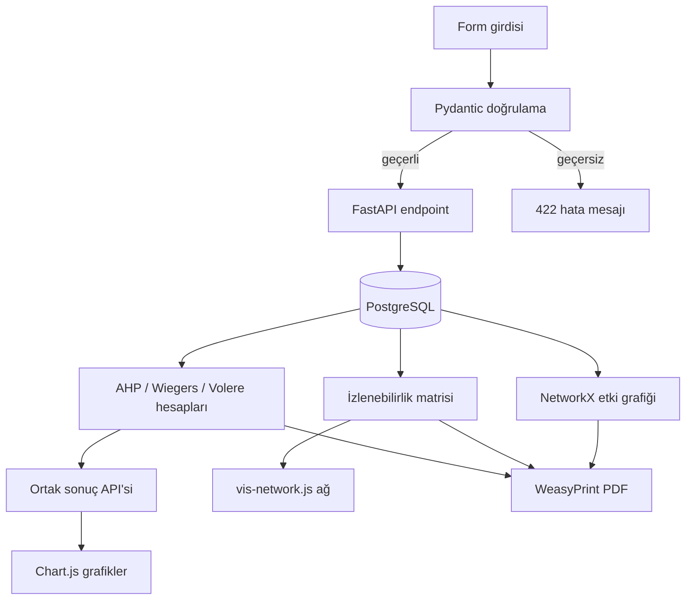

# Veri akış diyagramı

1. Gereksinim formu benzersiz anahtar, başlık, tür ve durumla kayıt oluşturur.
2. İlişki formu kaynak, hedef, ilişki türü ve yönlülüğü doğrular; tek kanonik ilişki kaydı saklanır.
3. AHP ikili karşılaştırmaları matrise; Wiegers dört faktöre; Volere en çok dört ağırlıklı kritere dönüşür.
4. Hesaplanan skorlar `PriorityScore` içinde ortak 0-100 alanında kalıcılaşır.
5. Matris, ağ ve etki analizi aynı ilişki kayıtlarını kullanır. Gereksinim güncelleme ekranı, kayıt sonrası etki uç noktasını çağırarak uyarı gösterir.
6. PDF rotası yöntem açıklaması, sonuçlar, SVG grafik, matris ve ilişki tabanlı etki özetini WeasyPrint ile üretir.
